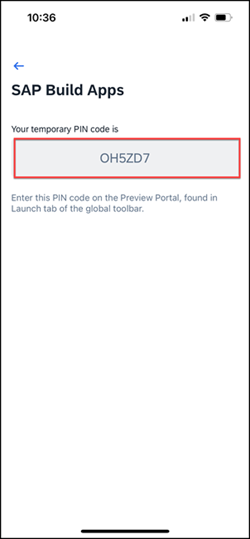
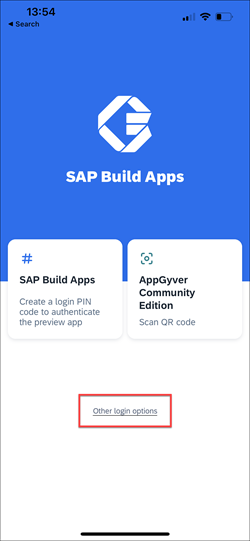
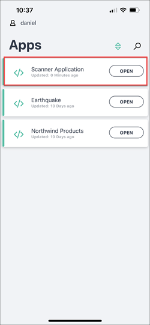

 
# Create an Application with SAP Build Apps
<!-- description --> Create an application with SAP Build Apps on SAP BTP. The application, created in a browser, can be used with the Previewer App to scan physical barcodes on food packaging to display calorific information.

## Prerequisites
- Access to SAP Build Apps – either on SAP BTP, as described in [Subscribe to the Low-Code / No-Code Service in SAP BTP](appgyver-subscribe-service) or the free community edition of SAP AppGyver, available at [AppGyver.com](https://www.appgyver.com).
 - Download the SAP Build Apps Previewer App on a smart phone or tablet: [iOS](https://apps.apple.com/us/app/sap-appgyver-preview/id1585856868) / [macOS](https://downloads.appgyver.com/SAP_AppGyver_preview_v3.4.4.zip)/ [Android](https://play.google.com/store/apps/details?id=com.sap.appgyver.preview.release)

## You will learn
  - How to create a no-code project with SAP Build Apps
  - How to add and edit visual elements in the SAP Build Apps Composer tool

## Intro
In this mission you will learn how to create a no-code application using the SAP Build Apps Composer tool. The application you create will enable you to scan a barcode on a smartphone and retrieve information from a public API. To do this, you will need to download the Preview app (available through iTunes and Google Play store).

The application you'll create across the tutorials will read barcodes from food packaging and display information about the product using the Open Food Facts API:

The steps provided detail the process using an SAP BTP account within a desktop browser. It is also possible to replicate many of the steps using a free account from [AppGyver.com](https://AppGyver.com).

All applications are created, edited, and managed within what we call a project, with one application created per project. Projects, and their related applications, are not automatically saved in this service, so care should be taken before closing a browser.

---

### Create SAP Build Apps project

>If you are working with the free version, just click **Create New**, fill in a name, and click **Create**.
>
> 

1. In BTP, SAP Build Apps projects are created from the application development lobby. To access this lobby from the SAP BTP Cockpit, click **Services - Instances and Subscriptions** and then select **SAP Build Apps**.

    

2. Within the application development lobby, click **Create > Build an Application**.

    

3. Enter `Scanner Application` for the project name, and an optional description, then click **Create**.

    

Your SAP Build application is created, with the Composer Pro view displayed. Once created, projects can be accessed again at any time from your application development lobby.

### Understand SAP Build Apps

When working with Composer Pro, the majority of your time will be spent in the App builder area. This area allows you to complete key tasks such as, but not limited to, the following:

- Define your app's structure and navigation logic
- Build pixel-perfect user interfaces
- Create complex logic with visual programming
- Integrate with external data resources
- Bind data to your components to create dynamic views, and more

For more detailed coverage of the features available in Composer Pro, view the [SAP Build Apps documentation](https://help.sap.com/docs/BUILD_APPS/431746e4c663458aa68d9754b237bfc6/daece9f87abf4f7187a14ae0b1f8b2ab.html).

### Edit app interface

You'll now start to create a basic layout for your application, starting with editing text.

Click the existing **Headline** field and edit the text to read:  `Barcode Scanner`

Click the **Paragraph** field and edit the text to read: `Scan a barcode of a food product using your smartphone`

### Add scan button

Next, you'll need to add a Scan button which, when tapped, will open the camera device on your smartphone.

To do this, locate the **Button** component (found under **Core > Forms**) and drag and drop this underneath the paragraph field.

Edit the Button text to read `Scan`.

Click **Save**.

The application is now saved in draft and available to preview using the Preview app on your smartphone.

### Preview app in previewer

1. Open the SAP Build Apps preview app.

2. Log in.

    Do one of the following

    - #### Using SAP Build Apps in EU10

        Click **Launch**, and then click **Open Preview Portal**.

        

        Now open the SAP Build Apps preview app on your mobile device, and click **SAP Build Apps**.

        

        This will display a pin code.

        

        Go back to SAP Build Apps on your desktop, and enter the pin code.

        

        This will refresh the preview app and display a list of your apps. 

    - #### Using SAP Build Apps in EU20

        Click **Launch**, and then click **Open Preview Portal**.

        Now open the SAP Build Apps preview app on your mobile device, and click **Other login options**.

        

        Change the edition to US10, and then click **Generate code**.

        
        
        Go back to SAP Build Apps on your desktop, and enter the pin code.

        This will refresh the preview app and display a list of your apps. 

    - #### Using SAP AppGyver Community Edition

        Click **Launch**.

        

        Click the big empty box to display a QR code.

        
    
        In the preview app on your mobile device, click **AppGyver Community Edition**, which opens the camera.

        Scan the QR code, which will open up your list of projects. 

3. Whichever method you used, you should now have a list of your apps.

    

    Click **Open** for the `Scanner Application` project.

    Your application starts to run.

