# Query with the SQL Console in SAP HANA Database Explorer
<!-- description --> Explore features of the SQL console and see how it facilitates querying an SAP HANA database.

## Prerequisites
 - An SAP HANA database such as SAP HANA Cloud trial or the SAP HANA, express edition that includes the SAP HANA database explorer
 - You have completed the first 3 tutorials in this group.

## You will learn
  - How to run SQL queries using the SQL console and add filters to the results
  - How to use different features of the SQL console including keyboard shortcuts, autocomplete, statement help, and the statement library

---

### Execute SQL


1. Select a connection and open the SQL console.

    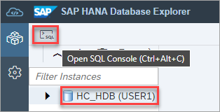

2. Notice that the database connection the SQL console is connected to is displayed and that toolbar items are shown after a left-click on the **...** icon.  There are options to connect, disconnect, or change the connection.

    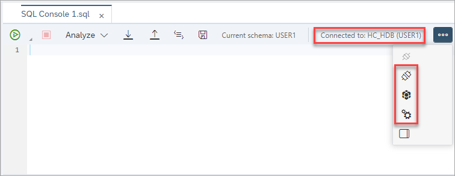  

3. Enter the SQL statements below.

    ```SQL
    SELECT * FROM HOTEL;
    INSERT INTO HOTEL VALUES(24, 'River Boat', '788 MAIN STREET', 'New Orleans', 'LA', '79872', NEW ST_POINT('POINT(-90.076919 29.957531)', 4326)); --will cause a unique constraint error when executed
    ```

4. Expand the **Run** dropdown menu.  Notice that there are multiple options along with their shortcut keys.

    

5. Choose **Run** to execute the SQL.  The records from the HOTEL table are shown in the results tab.

    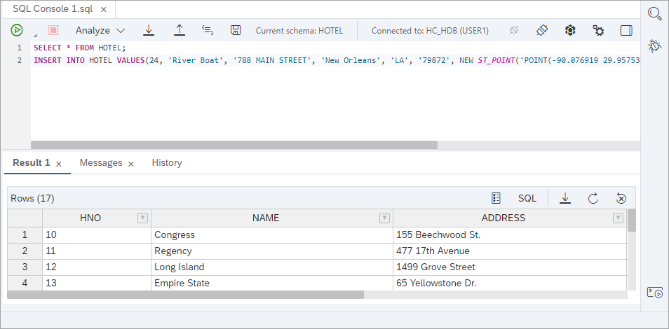

    > The unique constraint violation error is expected and is used here to demonstrate how the results of SQL execution are shown.

6. The results of a query can be downloaded and exported.

      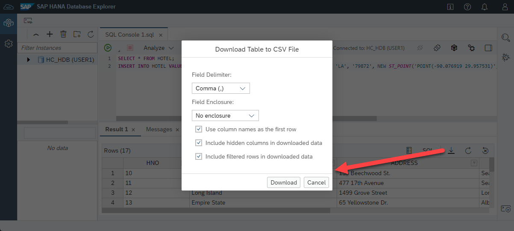

7. The **Messages** tab displays information about the executed queries as well as any errors.

    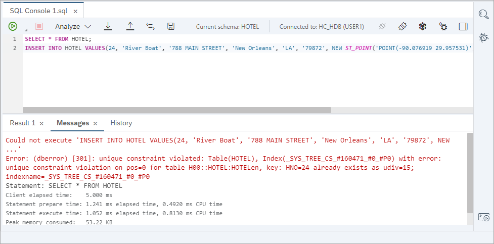

    > For SAP HANA on-premise, if the peak memory consumed metric is not shown, follow the instructions at the end of the [expensive statements trace](hana-dbx-troubleshooting) step.

8. The **History** tab displays the last 50 successfully executed queries.  A previously executed query can be searched for and recalled.

    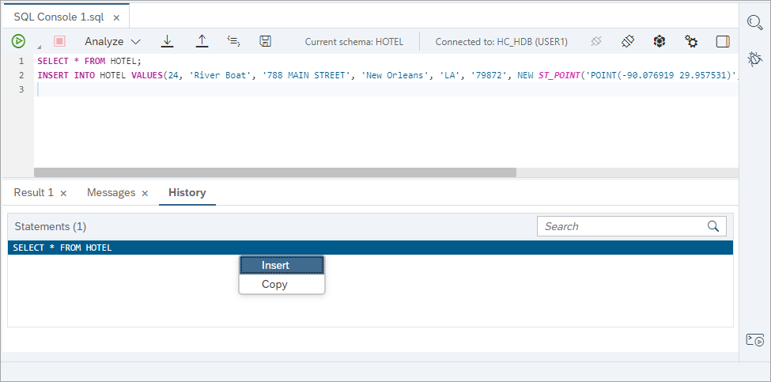

9. Reload the page.  Notice that when the SAP HANA database explorer re-loads, the SQL console tab and the  statements it has last run are shown, minus contents of the result, messages, and history tab.  

    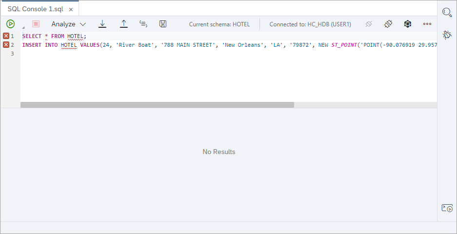

    This behavior can be set via the SQL console preferences which is shown in more detail in Step 5: SQL console preferences.

10. Sometimes you need to execute a SQL statement that takes a long time to run.  In that case, you can run it as a background activity.  This allows you to close your browser window and come back later to see the results of the statement.  

    

11. To view the results of a query that was run in the background, open the Background Activities Monitor, select the query, and then choose the Open Details icon.  A new SQL console will open displaying the SQL, the results, and any messages from the execution period.

    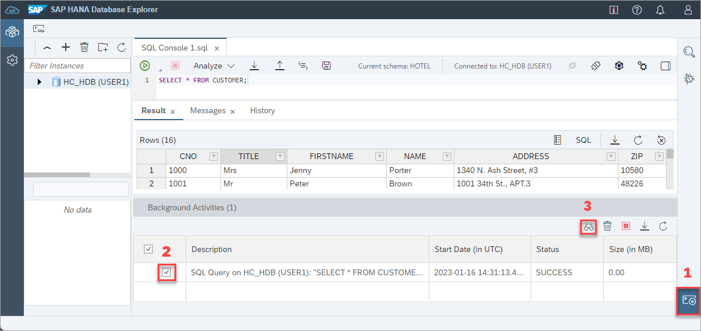

12. The SAP HANA database explorer provides the ability to run a query against multiple databases.

    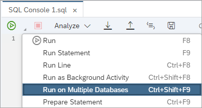

13. The below dialog enables multiple databases to be selected.

    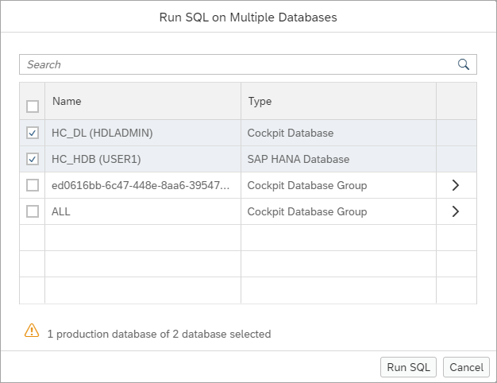

14. To view the results of a query run on multiple databases, open the Background Activities Monitor, select the query to view the result of, and then choose the Open Details icon or Download icon.

    

    The Download icon provides the results in a JSON document.

    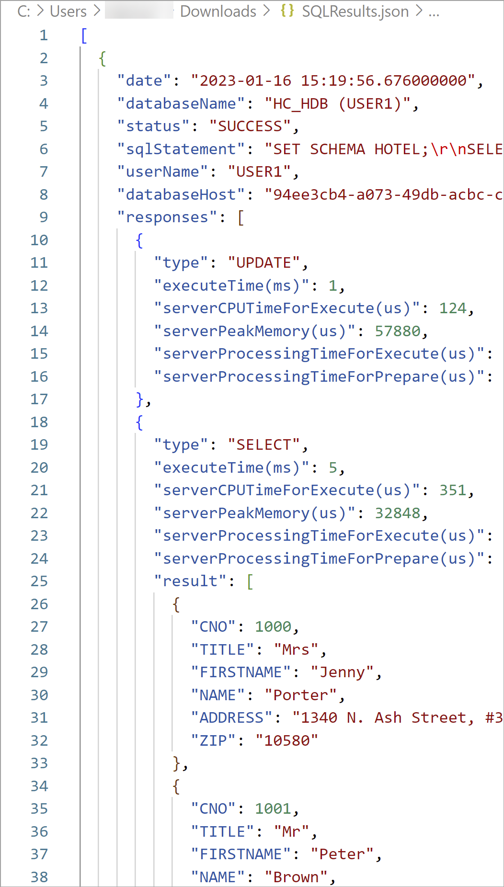

15. Returned results in HTML, XML, JSON, extended well-known binary formatted spatial data, or binary data can be displayed in a separate viewer.  Enter the SQL statements below and execute the query.

    ```SQL
    SELECT
    '{ "name":"John", "age":30, "cars": { "car1":"Ford", "car2":"BMW", "car3":"Fiat" }}'
    AS JSON_EXAMPLE FROM DUMMY;

    SELECT * FROM CUSTOMER FOR JSON;
    ```

    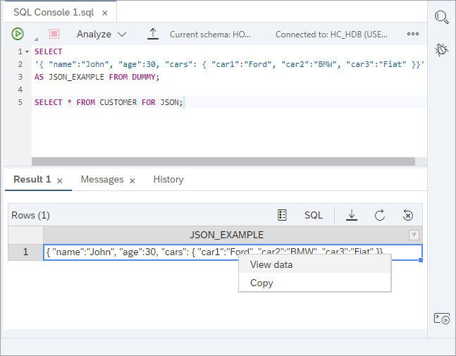

    Choose **View data** to open a viewer.

    

    To see an example on viewing spatial data, see [Try Out Multi-Model Functionality with the SAP HANA Database Explorer](hana-dbx-multi-model).


### Shortcuts


1. Keyboard shortcuts are available to provide alternate methods of completing frequently performed tasks. Right-click in the SQL console and choose **Keyboard Shortcuts**.

    

    The list of shortcuts displays.

    

2. Some commonly used keyboard shortcuts are highlighted in the table below:

    |  Action     | Shortcut
    |  :------------- | :-------------
    |  Add Comment Block           | `Ctrl+Shift+/`
    |  Comment/Uncomment Line         | `Ctrl+/`
    |  Format Code    | `Ctrl+B`
    |  Go to Next Error | `Alt+E`
    |  Go to Previous Error | `Alt+Shift+E`
    |  Increase/Decrease Font Size | `Crtl+Shift+Up` `Ctrl+Shift+Down`
    |  Jump to Matching Brackets | `Ctrl+Shift+M`
    |  Run All | `F8`
    |  Run Statement | `F9`
    |  Switch tabs      | `Ctrl+Alt+Pageup` `Ctrl+Alt+Pagedown`
    |  Text Completion | `Ctrl+Space` (requires two or more characters to be entered)

3. Shortcuts can be configured in **Global Preferences** under **Keyboard Shortcuts**.

    

    > Double-click on the shortcut to start the recording.

4. A SQL console can be toggled to enter full-screen mode.  Double-click a SQL console tab to enter this mode.  

    

    To exit full screen, double-click the SQL console tab again.

5. When the Run icon is pressed with a portion of the statements selected, only the selected statements are run.  In the example below, only the SELECT statement was run.  

    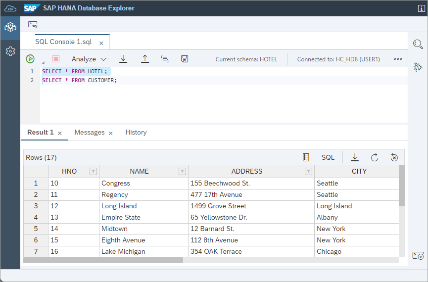


### Autocomplete


1. Once a statement is started, press `Ctrl+Space` to see a list of possible statements based on what you have typed.  

    

2. By selecting the statement, you want to use from the provided options, the SQL statement will be written into the console. Some information will need to be filled into the generated statement. In the example below, table names need to be replaced and the columns to be used in the ON clause need to be provided.

    

3. In addition to completing SQL statements, this autocomplete shortcut can also be applied to database objects. In the example below, autocomplete provides a dropdown of all the available tables matching the first couple of letters provided.

    Copy the following SQL statement into the console and then use the autocomplete shortcut to see the available tables:

    ```SQL
    SELECT * FROM HOTEL.RES
    ```

    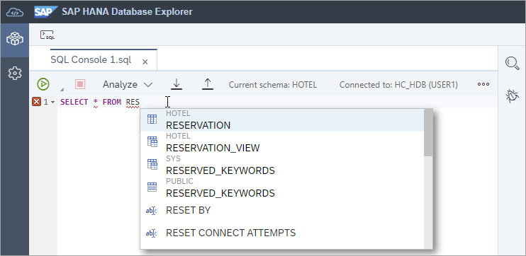


### Statement help panel


1. On the right-hand side of the SQL console, there is a statement help panel that provides more information about statement syntax, and any tables, functions, stored procedures, or SQL functions that have been referenced.

    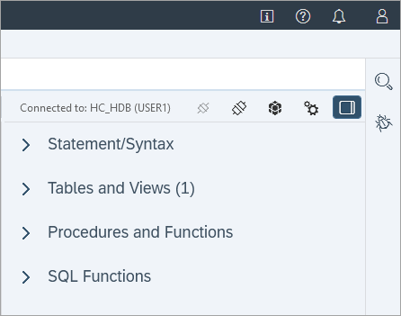

2. The first section in the help panel is Statement/Syntax.  This section looks at the keywords in the current SQL statement and identifies what type of statement is written. It provides information on the proper syntax for that statement.

    Copy the following SQL into the SQL console to populate the Statement/Syntax section of the help panel:

    ```SQL
    SELECT
      H.NAME AS HOTEL_NAME,
      R.TYPE,
      R.FREE,
      R.PRICE
    FROM
      ROOM AS R
      LEFT OUTER JOIN
      HOTEL AS H
      ON R.HNO = H.HNO;
    ```

    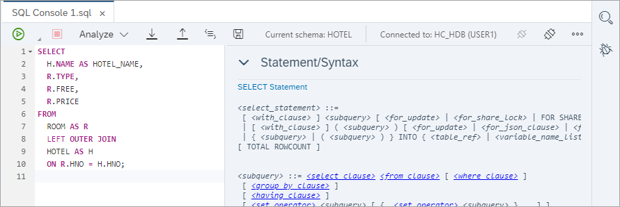

    > If you left-click the name of the statement being displayed in the Statement/Syntax dropdown (blue link), you will be redirected to an SAP document providing more information on that particular statement.
    >
    >

3. The second section shows tables or views referenced in the SQL statement, the schema it belongs to, and the columns in that table/view.

    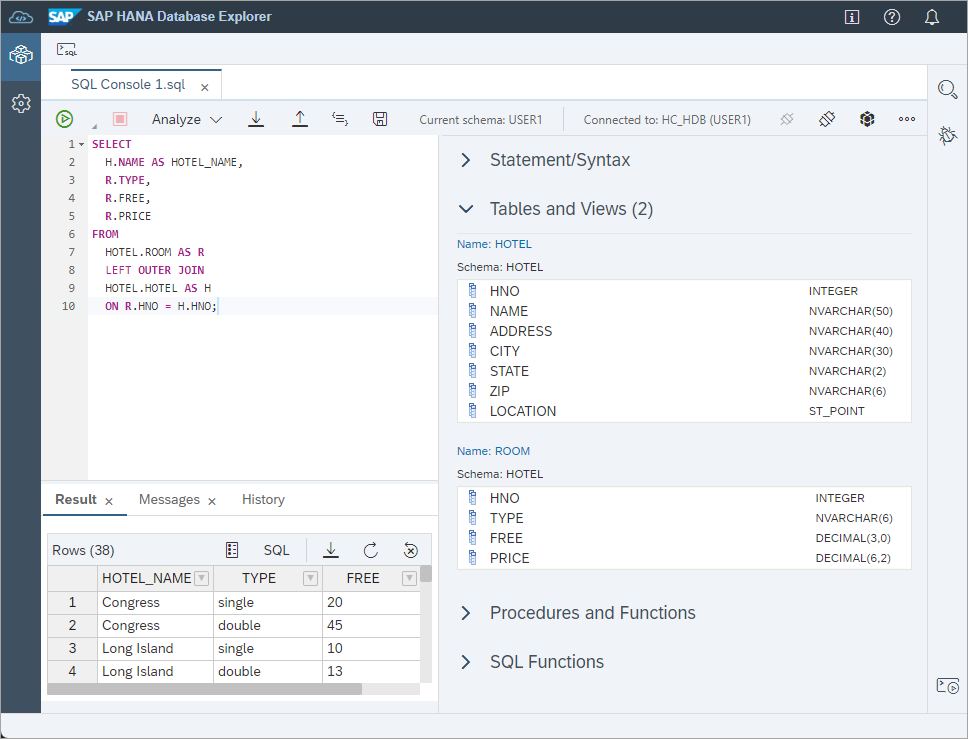

    >The object editor can be opened by clicking on the name of the table or view.

4. The third section shows stored procedures or functions that are referenced in the SQL statement, as well any input and output parameters.

    Copy the following SQL into the SQL console to populate the Procedures and Functions section of the help panel:

    ```SQL
    SELECT AVERAGE_PRICE('suite') FROM DUMMY;
    ```

    

5. The final section in the help panel shows any SQL functions that have been included in the SQL. For each SQL function referenced, both input and return parameters are listed.

    Copy the following SQL into the SQL console to populate the SQL Functions section of the help panel:

    ```SQL
    SELECT TYPE, TO_DECIMAL(ROUND(sum(PRICE) / COUNT(*), 2, ROUND_HALF_UP)) as "Avg Room Price"
    FROM ROOM
    GROUP BY TYPE;
    ```

    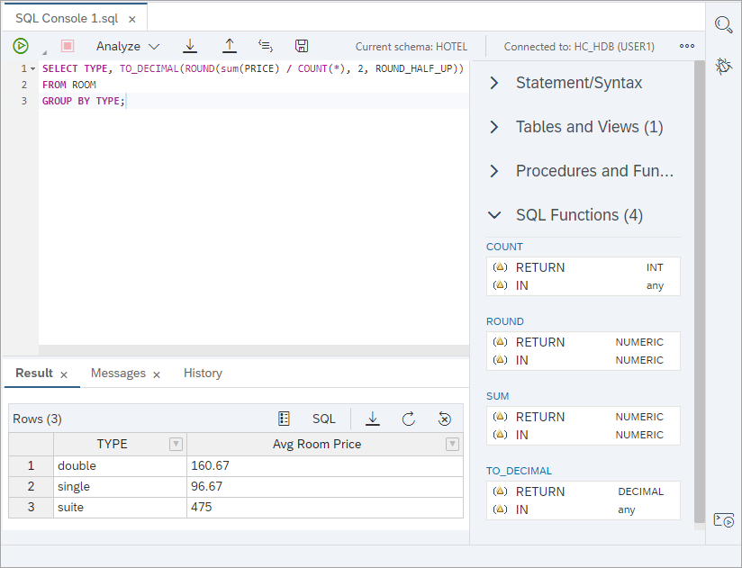

    >Left-click the name of the SQL function in the SQL Functions section to open the SAP help showing detailed information on the function.


### SQL console preferences


1. Select **SQL Console** or **SQL Code Completion** from the Global Preferences to see the configurable preference settings for the SQL console.

    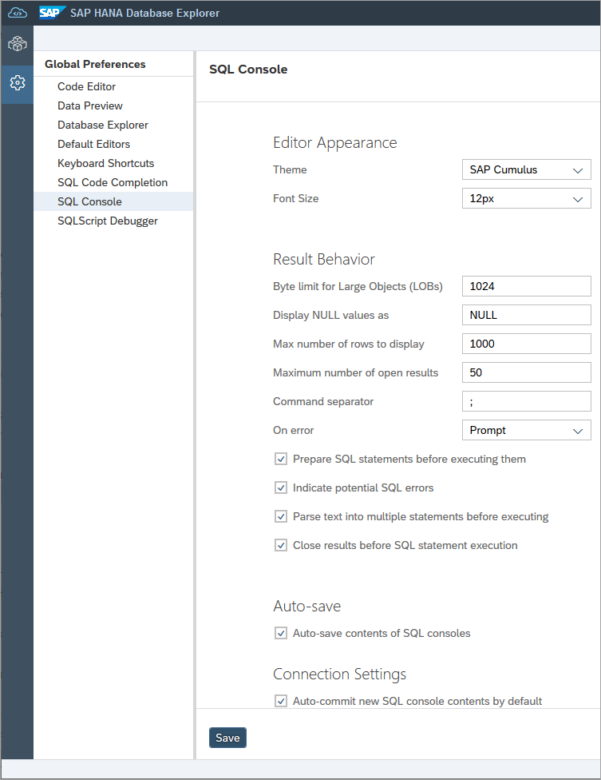

    >When changing these preferences, remember to press the **Save** button.

2. Notice that there is a preference to limit the number of rows to display as well as the maximum number of open results.  The following shows the results of these being set to 50 and 2.

    

3.  The default behavior when an error is encountered is to show the following dialog.  

    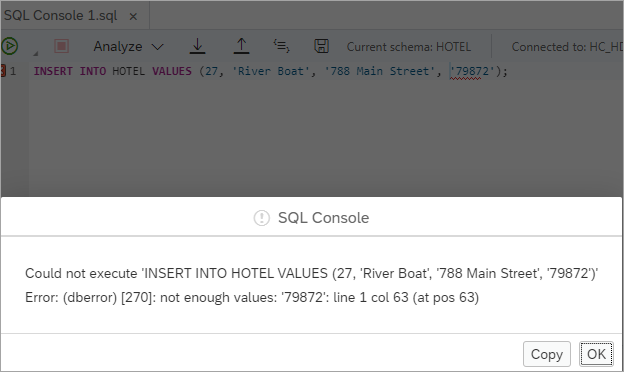

    This behavior can be changed using the **On error** dropdown menu in the SQL console preference settings.

    

4. There is also a syntax checker in the SAP HANA database explorer.

    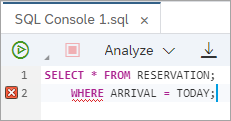

    It can be enabled or disabled using the  **Indicate Potential SQL Errors** checkbox.

    

  For additional details, consult [SQL Console Preferences](https://help.sap.com/viewer/a2cea64fa3ac4f90a52405d07600047b/cloud/en-US/2f39e4fdd67545cf805b557357c5a7b3.html).


### Statement library


The statement library contains a mix of pre-populated system statements and user-saved statements.

1. Frequently used statements can be saved to the statement library for easy access.  Enter the statement below into the SQL console and click the **Add to Statement Library** icon.

    ```SQL
    /*

    [DESCRIPTION]

    - Future guest check-ins across all hotels

    */

    SELECT * FROM RESERVATION
        WHERE ARRIVAL >= CURRENT_DATE;
    ```

    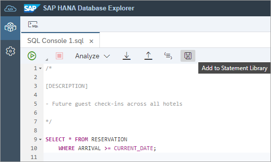


2. A dialog will appear where you can name the query to be saved.

    

3. To view the statement library, right click a database connection and select **Show Statement Library**.

    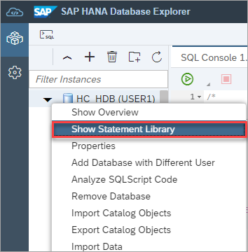

4. In the statement library there are two types of statements:  user-defined and system. This is shown in the Type column. User-defined statements are statements that you have created and added, like All Future Check-ins, while system statements are already created and added to the library. System statements are often used for monitoring and diagnostic purposes.

    

    >Previously, some of the included system statements came from [SAP Note 1969700 - SQL Statement Collection for SAP HANA](https://launchpad.support.sap.com/#/notes/1969700).  If you wish to add these, they can be downloaded from the SAP Note referenced above and added as user statements.  Another source of diagnostic information are the SQL queries contained in [`M_SYSTEM_INFORMATION_STATEMENTS` System View](https://help.sap.com/viewer/c1d3f60099654ecfb3fe36ac93c121bb/latest/en-US/20c5dfac751910148a3fc81b81b2d19b.html).

5. To run a statement, select one from the statement library and click the **Open in SQL Console** icon.

    

    >It is also possible to export and import SQL statements directly to/from the file system.  
    >
    >
    >
    >Files can then be shared using a version control system such as git.

6. User-defined statements can be edited. From the Statement library, select the desired statement to open it within the SQL console and make the desired changed. Select **Add to Statement Library** to overwrite the previous statement.

    


### Knowledge check

Congratulations! You have now explored selected features of the SQL console.

---
