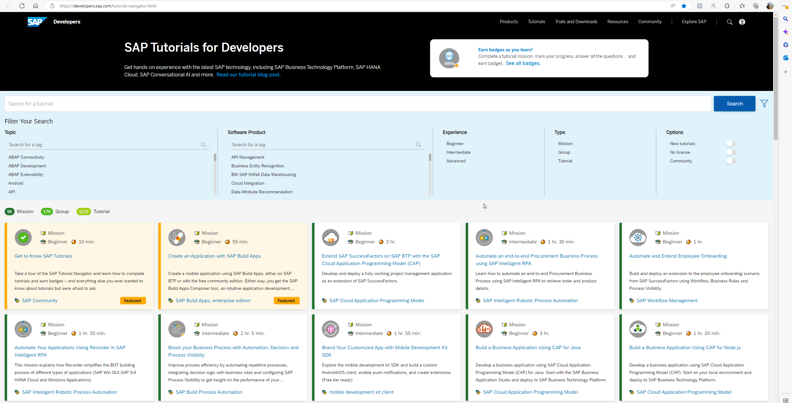
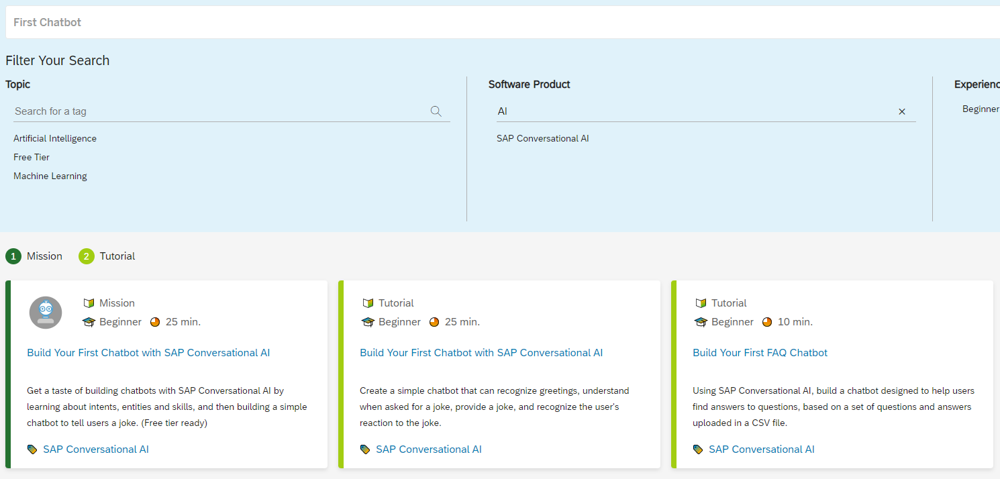
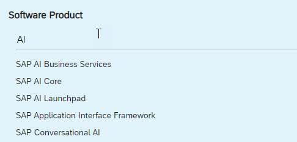
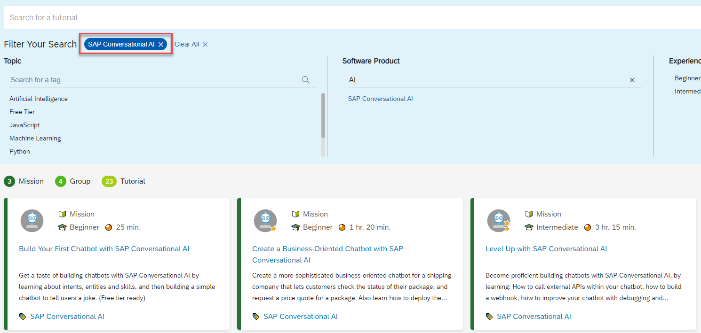
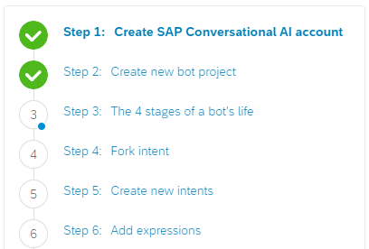
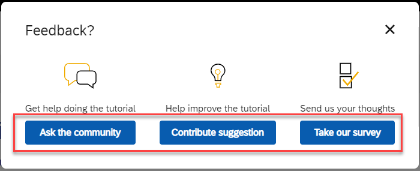
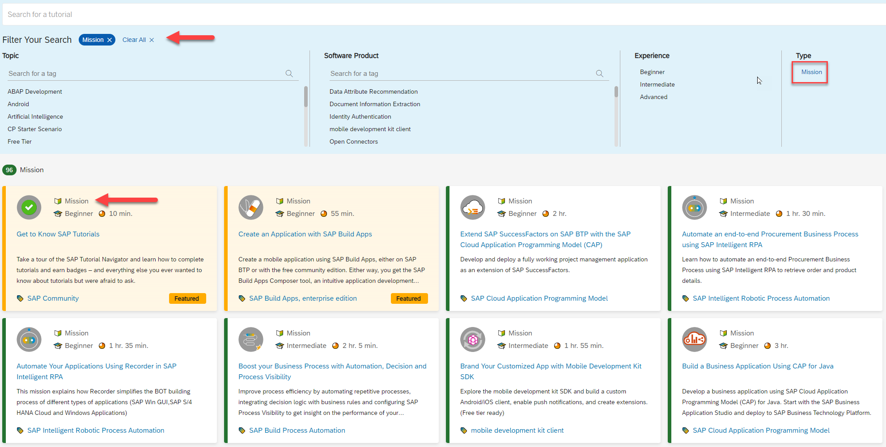

# Get to Know SAP Tutorials
<!-- description --> Take a tour of the SAP Tutorial Navigator and learn how to complete tutorials and earn badges – and everything else you ever wanted to know about tutorials but were afraid to ask.

## Prerequisites
- You can view the tutorials without an SAP ID, but you will not be able to keep your progress and earn badges without an SAP ID (nor do this tutorial and earn the tutorial beginner badge). If you don't have one, go to [Create your SAP Universal ID](https://account.sap.com/core/create) or click the person icon at the top-right of this page .

## You will learn
  - How to search for tutorials
  - How to complete a tutorial
  - How to earn badges 😀
  - How to see your badges on your profile
  - How to give feedback

## Intro
We want to give a very quick tour of SAP Tutorials.

Since you are already doing a tutorial -- this tutorial -- you already know some of the basics. Still, we'd like to review some things maybe you didn't know.

>**The main thing to know:** the SAP Tutorial Navigator now provides over 1,000 tutorials contained within hundreds of scenarios and projects.

---

### Start to complete this tutorial

In every step of a tutorial, you have either a **Done** button or a question you have to answer. This let's you indicate that you have completed the step and to keep track of your progress.

In order to keep your progress, you must be logged into your SAP account. If the **Done** or **Submit Answer** button has a lock on it, then click it and you will be automatically logged in.

>You can also click the person icon at the top right of the page.

>

After clicking the button, it should look like this:

Below, in this step, click the **Done** button (if it is locked, once you are logged in, click it again).

### Open the Tutorial Navigator

Go to <https://developers.sap.com/tutorial-navigator.html> to open the SAP Tutorial Navigator.

If you want to search for tutorials related to a particular product, select a filter under **Software Product**.

You can filter the filters by entering some text, for example, type in `AI` to find the filter for **SAP Conversational AI**.

You can do the same for **Topics**, for such general categories like **Java** or **iOS**.

### Search for a tutorial

Of course, you can do a free text search, which will match words in the title or description.

Search for a mission that matches `First Chatbot`

You can instead search by tag, so if I wanted to get all the SAP Conversational AI tutorials, I could enter `AI` in the filter search ...

... and then select the SAP Conversational AI tag.

Of course, you can use both. For example, search for `Python` and then further filter by `SAP Conversational AI` tag.

>More information on tags? See [Using Tags](https://community.sap.com/resources/using-tags).

### Open mission

Make sure you are back in the SAP Tutorial Navigator.

Click the tile called **Build Your First Chatbot with SAP Conversational AI**, which opens the mission page.

You now see the list of tutorials you must finish to complete this mission, in this case, just a single tutorial called **Build Your First Chatbot with SAP Conversational AI**.

You can also see, in the top-left corner, the badge you will earn if you complete the mission.

### Open tutorial

Open the tutorial **Build Your First Chatbot with SAP Conversational AI**.

The top part of the tutorial is made up of the following:

1. Basic information about the tutorial

    - Title
    - Description
    - Level
    - Time to complete
    - Who wrote it (with link to their GitHub account)

2. The main skills you will learn

3. The mission/group that contains this tutorial (and navigation buttons to the next and previous tutorials).

4. Links to the steps inside this tutorial, so you can quickly see what steps make up the tutorial.

    Steps with a small blue circle show steps that have a question for you to answer.

    

### See your progress

While you are doing the tutorial, you can see your progress as follows.

If you have been clicking the buttons as you complete this tutorial until here, on the right side, you will see the steps you have completed indicated by a checkmark:

    

### Provide feedback

While you are doing the tutorial, you have the option of providing feedback to:

- Get help doing a tutorial, by opening up a question in Answers in the SAP Community.

- Tell us how we can improve a tutorial, by reporting a bug and opening up an issue in our GitHub repository.

You can also take our survey, and just provide us with feedback on how we are doing. Be gentle.

### What badges can you earn?

Every mission in the Tutorial Navigator can earn you a badge. To see all the missions, open the [Tutorial Navigator](https://developers.sap.com/tutorial-navigator.html) and then filter by mission.

You can also see all available badges -- not just tutorials but also community missions -- on the [badges](https://community.sap.com/resources/missions-badges) page.

On the right of the badges page, you can filter the badges, including to see only tutorial-related badges.

The badges you earn appear in the **Earned Missions** tab of your [SAP profile](https://people.sap.com/#missions:earned).

### What other achievements are there?

You can also see a list of key achievements that can you obtain, like doing your first tutorial or completing 3 missions.

Go back to the [developers home page](https://developers.sap.com), and make sure you are logged in with your SAP ID (top right). Scroll down a little and on your right are your achievements.

### Test yourself

Now that you toured the Tutorial Navigator, you can get credit for doing this tutorial by clicking all the **Done** buttons in the steps above, and answering the following question.

---
